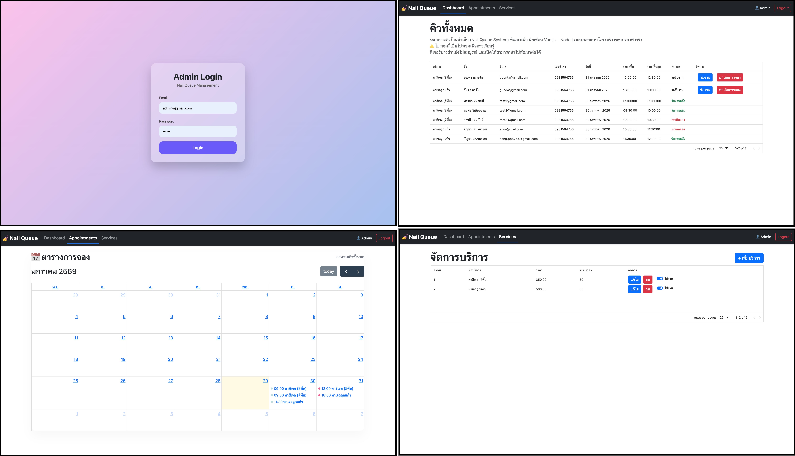
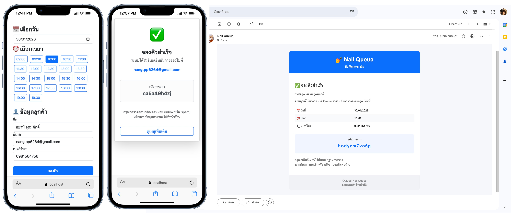

---

# 💅 Nail Queue System

ระบบจองคิวร้านทำเล็บ (Nail Queue System)  
โปรเจคนี้พัฒนาขึ้นเพื่อ **ฝึกเขียน Vue.js และ Node.js**  
ใช้เป็น **Demo Project / Portfolio** สำหรับการเรียนรู้และสมัครงาน

> โปรเจคนี้ไม่ใช่งานเชิงพาณิชย์  
> ฟีเจอร์บางส่วนยังไม่ครบ และสามารถนำไปพัฒนาต่อได้

---

## ✨ Features

### 👩‍💻 ฝั่งลูกค้า
- เลือกบริการทำเล็บ
- เลือกวันที่ต้องการจอง
- แสดงช่วงเวลาที่ว่างตามวันนั้น
- จองคิวโดยไม่ต้องสมัครสมาชิก
- แสดงหน้าจองสำเร็จ
- ส่งอีเมลยืนยันการจอง

---

### 🧑‍💼 ฝั่งผู้ดูแลระบบ (Admin)
- Login / Logout
- จัดการบริการ (เพิ่ม / แก้ไข / ลบ)
- ดูรายการนัดหมายทั้งหมด
- แสดงข้อมูลนัดหมายในรูปแบบ Calendar
- แยกสีสถานะของคิวในปฏิทิน

---

## 🗓️ Calendar System
- แสดงคิวแบบปฏิทินรายเดือน
- แต่ละคิวแสดงเวลาและรายละเอียด
- สีของจุด/รายการอิงจากสถานะการจอง

---

## 🧱 Tech Stack

### Frontend
- Vue 3
- Composition API
- Vue Router
- Axios
- Bootstrap 5
- FullCalendar
- Day.js

### Backend
- Node.js
- Express.js
- MySQL
- Nodemailer
